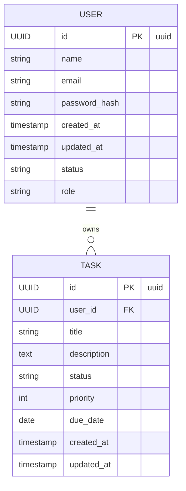

# Database schema: User and Task

This document describes a simple `user` and `task` table design, their properties, and the link between them. Includes SQL `CREATE TABLE` statements (Postgres dialect), a Mermaid ER diagram, and an ASCII fallback.

**User Table**
- **Purpose**: store application users and their credentials/profile.
- **Primary key**: `id` (UUID)
- **Columns**:
	- `id`: UUID, primary key
	- `name`: varchar(255), user's display name
	- `email`: varchar(320), unique, indexed
	- `password_hash`: varchar(255), salted hash
	- `role`: varchar(50), e.g. `user`, `admin`
	- `status`: varchar(50), e.g. `active`, `blocked`, `pending`
	- `created_at`: timestamptz, default `now()`
	- `updated_at`: timestamptz, default `now()`

Example SQL (Postgres):

```
CREATE EXTENSION IF NOT EXISTS "uuid-ossp";

CREATE TABLE "user" (
	id UUID PRIMARY KEY DEFAULT uuid_generate_v4(),
	name VARCHAR(255) NOT NULL,
	email VARCHAR(320) NOT NULL UNIQUE,
	password_hash VARCHAR(255) NOT NULL,
	role VARCHAR(50) NOT NULL DEFAULT 'user',
	status VARCHAR(50) NOT NULL DEFAULT 'active',
	created_at TIMESTAMPTZ NOT NULL DEFAULT now(),
	updated_at TIMESTAMPTZ NOT NULL DEFAULT now()
);

-- Recommended index for lookups by email
CREATE INDEX IF NOT EXISTS idx_user_email ON "user" (email);
```

**Task Table**
- **Purpose**: store tasks that belong to users.
- **Primary key**: `id` (UUID)
- **Foreign key**: `user_id` references `user(id)`
- **Columns**:
	- `id`: UUID, primary key
	- `user_id`: UUID, FK to `user(id)` (owner/assignee)
	- `title`: varchar(255), short title
	- `description`: text, optional
	- `status`: varchar(50), e.g. `todo`, `in_progress`, `done`
	- `priority`: integer, small int (e.g. 1..5)
	- `due_date`: date, optional
	- `created_at`: timestamptz, default `now()`
	- `updated_at`: timestamptz, default `now()`

Example SQL (Postgres):

```
CREATE TABLE task (
	id UUID PRIMARY KEY DEFAULT uuid_generate_v4(),
	user_id UUID NOT NULL,
	title VARCHAR(255) NOT NULL,
	description TEXT,
	status VARCHAR(50) NOT NULL DEFAULT 'todo',
	priority SMALLINT NOT NULL DEFAULT 3,
	due_date DATE,
	created_at TIMESTAMPTZ NOT NULL DEFAULT now(),
	updated_at TIMESTAMPTZ NOT NULL DEFAULT now(),
	CONSTRAINT fk_task_user FOREIGN KEY (user_id) REFERENCES "user" (id) ON DELETE CASCADE
);

CREATE INDEX IF NOT EXISTS idx_task_user_id ON task (user_id);
CREATE INDEX IF NOT EXISTS idx_task_status ON task (status);
CREATE INDEX IF NOT EXISTS idx_task_due_date ON task (due_date);
```

**Relationships & Notes**
- **One-to-many**: A `user` can have many `task` rows. `task.user_id` references `user.id`.
- **Cascading**: The FK uses `ON DELETE CASCADE` so deleting a user removes their tasks. Change to `SET NULL` or `RESTRICT` if you prefer preventing deletes or keeping orphaned tasks.
- **Uniqueness**: `email` is unique in `user`.
- **Indexes**: index `email`, `task.user_id`, `task.status`, and `task.due_date` for common filters.
- **Timestamps**: maintain `updated_at` via application logic or DB trigger.

**Mermaid ER Diagram**



**ASCII fallback diagram**

```
+-------------------+        1       +----------------------------+
|      user         |----------------|          task              |
+-------------------+                +----------------------------+
| id (PK, uuid)    |  <--- user_id  | id (PK, uuid)              |
| name             |                | user_id (FK -> user.id)    |
| email (unique)   |                | title                      |
| password_hash    |                | description                |
| role             |                | status                     |
| status           |                | priority                   |
| created_at       |                | due_date                   |
| updated_at       |                | created_at                 |
+-------------------+                | updated_at                 |
																			+----------------------------+
```

**Example queries**

```
-- Get all tasks for a user
SELECT * FROM task WHERE user_id = '...';

-- Get overdue high-priority tasks
SELECT * FROM task WHERE due_date < now()::date AND priority >= 4 AND status != 'done';

-- Create a task for a user (example)
INSERT INTO task (user_id, title, description, status, priority, due_date)
VALUES ('user-uuid', 'Buy supplies', 'Buy pens and paper', 'todo', 2, '2025-12-20');
```

**Optional extensions**
- Add a `task` history table for auditing changes.
- Add a `labels` table and a `task_labels` join table for many-to-many tagging.
- Add optimistic locking with a `version` integer column on `task`.

---

If you want, I can:
- generate migration SQL files for your preferred DB (Postgres, MySQL, SQLite),
- add triggers to keep `updated_at` current, or
- scaffold a simple API model layer (Node/Express or Prisma) using this schema.

